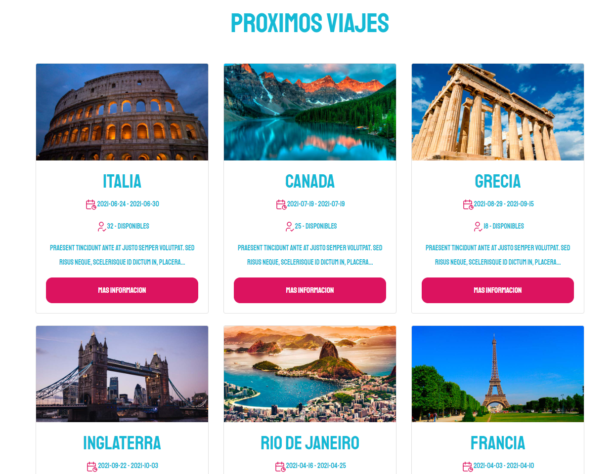
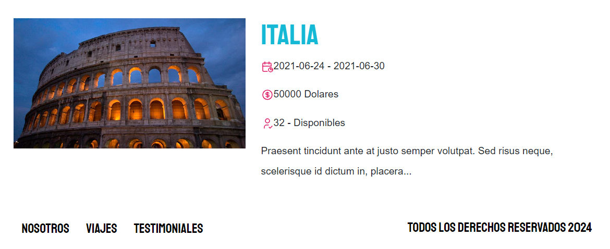
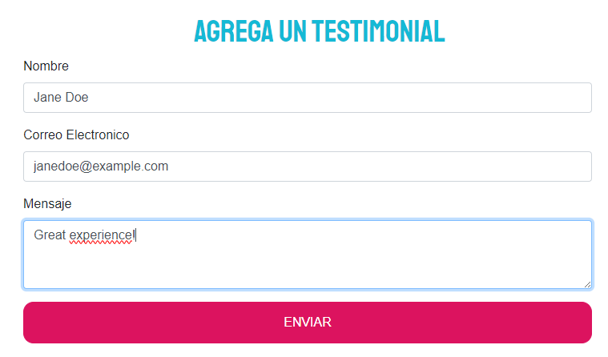
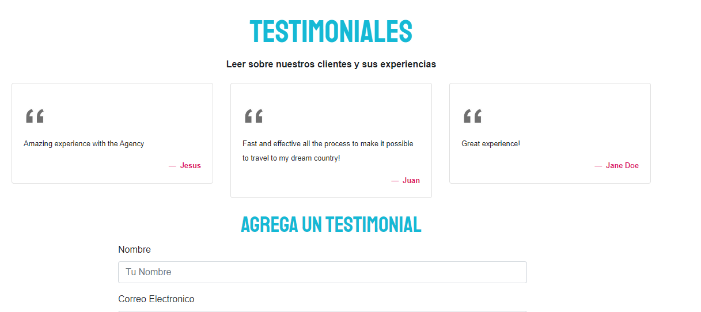

# Agencia Viajes Node

This project was about a travel agency, where the customers can see what the agency offers such as travels around the world, testimonals of the people that hired those services for a specific travel and prices for different places in all continents.
Using Model View Controller as a arquitecture pattern. 

## Built with
<ul>
    <li>
         HTML 
    </li>
    <li> CSS </li>
    <li> JavaScript </li>
    <li> NodeJS </li>
    <li> Express.js </li>
    <li> Sequelize </li>
    <li> Pug as a Template Engine </li>
    <li> MySQL </li>
</ul>

### Overview
This project covers all the crud operations, the client side uses HTML, CSS, JS and a template engine Pug, as for the server side NodeJS with Express for the routes was used, Sequelize for the ORM in order to make the project more easier and MySQL for the database.
All of that with an arquitecture pattern such as MVC to separate everything.

### Travels Section

All Travels fetched from the DB along with an endpoint for each travel for more information about it.

### Testimonial Section
The customer or user can see all the testimonials submitted by the people who used the Travel Agency, as well can leave a testimonial himself.

